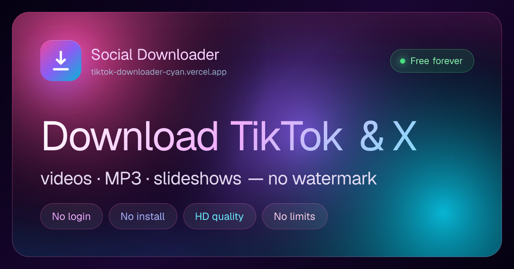

# Social Media Downloader

> Download TikTok, Twitter/X, Instagram, Facebook, YouTube, Pinterest, Reddit, Threads, Snapchat, Twitch & Vimeo videos without watermarks — HD video, reels, Shorts, MP3 audio, photo carousels, and ffmpeg-rendered slideshow MP4s. Free, no login, no limits. Installs as an app.



[](https://nextjs.org)
[](https://react.dev)
[](https://www.typescriptlang.org)
[](https://tailwindcss.com)
[](https://web.dev/progressive-web-apps/)
[](LICENSE)

### 🚀 [Try it live →](https://www.socialdownloader.space)

A free, watermark-free downloader for **TikTok, Twitter/X, Instagram, Facebook, YouTube, Pinterest, Reddit, Threads, Snapchat, Twitch, and Vimeo**. Paste a link and get an HD video, reel, or Short, MP3 audio, a photo carousel (individual images or a ZIP), or a fully rendered slideshow MP4 with the original soundtrack — no login, no install required, runs in your browser.

It's also an **installable app (PWA)**: add it to your home screen and share links straight from the TikTok, Instagram, or YouTube app — no browser, no copy-paste.

A free, open-source alternative to SnapTik, SSSTik, SaveTT, SnapInsta, Y2mate, and GetFvid — with **no ads, no tracking, and a multi-source fallback chain** so downloads keep working when any single provider goes down.

⭐ **If this tool is useful to you, please [star the repo](https://github.com/Vette1123/social-media-downloader/stargazers)** — it helps others find it.

Built with Next.js 16, React 19, TypeScript, Tailwind CSS 4, and Motion by [Mohamed Gado](https://www.mohamedgado.com).

## Why use it

- **11 platforms, one paste box.** TikTok, X, Instagram, Facebook, YouTube, Pinterest, Reddit, Threads, Snapchat, Twitch, and Vimeo — auto-detected from the URL.
- **No watermark, HD by default.** Clean video with a one-tap fallback to SD, plus MP3 audio extraction on every platform that carries sound.
- **No login, no API key, no daily limit.** Nothing to sign up for and nothing installed unless you want the app.
- **Private by design.** No accounts, no tracking of what you download. Your Recent list lives only in your own browser.
- **Resilient.** A per-platform fallback chain quietly retries other sources, so a single provider outage doesn't break your download.
- **Installable PWA.** Home-screen icon, app shortcuts, and native share-in from other apps.

## Features

### Platforms

**TikTok**

- HD video downloads without the watermark
- Extract the soundtrack as MP3 (re-served with `audio/mpeg`)
- Photo carousels (slideshows): preview every image, save individually or as a ZIP, keep the original background music
- Render a TikTok slideshow into a real MP4 video (ffmpeg) when the platform only ships images

**Twitter / X**

- Native video and GIF extraction from any `twitter.com` or `x.com` status URL
- Resolves `t.co` short links

**Instagram**

- Download reels and feed videos in their original quality
- Save single-photo posts and multi-image carousels — individually or as a ZIP
- Extract the audio track from a reel as MP3
- Works with `instagram.com/p/…`, `/reel/…`, `/tv/…` and share links — no login required

**YouTube**

- Download videos and Shorts in HD as MP4
- Extract the audio track as MP3
- Rich metadata (title, channel, thumbnail) pulled from YouTube's public oEmbed
- Works with `youtube.com/watch?v=…`, `youtu.be/…`, `/shorts/…`, and `/embed/…`

**Facebook**

- Download public videos, watch clips, and reels in HD
- Extract the audio track as MP3
- Resolves `fb.watch/…` short links and `/share/…` links automatically
- Works with `facebook.com/…/videos/…`, `facebook.com/watch/?v=…`, and `facebook.com/reel/…`

**Pinterest**

- Download Pin videos and images from `pinterest.com/pin/…` (and `pin.it` short links)

**Reddit**

- Download videos from `reddit.com/r/…/comments/…` posts and `/s/…` share links

**Threads**

- Download videos and images from `threads.net` / `threads.com` posts

**Snapchat**

- Download Spotlight clips and public story/profile media

**Twitch**

- Download clips and VODs from `twitch.tv/…/clip/…`, `clips.twitch.tv/…`, and `twitch.tv/videos/…`

**Vimeo**

- Download videos from `vimeo.com/…` and `player.vimeo.com/…` via a dedicated extractor

### App experience

- **Installable PWA** — add to your home screen and launch it like a native app (standalone, own icon, splash).
- **Share Target (Android)** — installing registers the app as a share destination, so you can hit **Share → Social Downloader** from inside TikTok/Instagram/YouTube and land straight on a resolved download. No browser, no paste.
- **App shortcuts / jump list** — long-press the installed icon to jump straight to the TikTok, X, Instagram, YouTube, or Facebook downloader.
- **iOS add-to-home hint** — a quiet, on-brand nudge with the exact "Share → Add to Home Screen" steps, plus an iOS save hint on results.
- **One-tap paste** — reads the clipboard and resolves the link in a single tap.
- **Batch paste** — drop a whole list of links (one per line or space-separated); every URL is pulled out, de-duplicated, and resolved in turn with live progress.
- **Result re-pick** — switch a resolved result between **HD / SD / MP3** without re-pasting; your choice is remembered for the next link.
- **Recent** — a local, privacy-friendly history of what you've grabbed (branded per-platform tiles, "View all"), stored only in your browser and re-resolvable in one tap. Never stores the short-lived CDN/stream URL.

### Quality of life

- Inline video and image previews before downloading
- Multi-source fallback chain per platform (resilient against any single provider going down)
- Warm-instance resolve cache and direct tunnel downloads for faster, lighter fetches
- CORS-proxied media routes so downloads (and Instagram's hotlink-protected CDN) work cross-origin, with HTTP range support for seek/preview
- Inline URL validation, smooth motion animations, fully responsive layout, low-power/touch-aware effects
- Eleven dedicated, SEO-tuned landing pages (one per platform)
- Production-grade SEO: dynamic OpenGraph and Twitter card images, per-platform OG images, JSON-LD (WebSite, Person, SoftwareApplication, HowTo, FAQPage), hreflang, sitemap, IndexNow ping on build, and a PWA-tuned manifest
- No registration, no API keys, no daily limit

## Tech stack

| Layer            | Technology                          |
| ---------------- | ----------------------------------- |
| Framework        | Next.js 16 (App Router), React 19   |
| Language         | TypeScript 6                        |
| Styling          | Tailwind CSS 4                      |
| Animation        | Motion (formerly framer-motion) 12  |
| Icons            | lucide-react                        |
| HTTP             | Axios                               |
| HTML scraping    | Cheerio                             |
| ZIP bundling     | JSZip                               |
| Slideshow video  | fluent-ffmpeg + @ffmpeg-installer   |
| YouTube fallback | youtube-dl-exec                     |
| Dynamic OG       | @vercel/og (edge runtime)           |
| Analytics        | Vercel Analytics                    |
| App shell        | PWA manifest + Share Target + shortcuts |

## Getting started

**Prerequisites:** Node.js 20+ (24 LTS recommended), pnpm.

```bash
git clone https://github.com/Vette1123/social-media-downloader.git
cd social-media-downloader
pnpm install
pnpm dev
```

Open <http://localhost:3000>.

Build for production:

```bash
pnpm build && pnpm start
```

### Environment variables

All optional — the app runs without any config.

| Variable              | Purpose                                                                          |
| --------------------- | -------------------------------------------------------------------------------- |
| `NEXT_PUBLIC_SITE_URL`| Canonical site URL used for metadata, sitemap, and OG images.                    |
| `COBALT_API_URL`      | Self-hosted [Cobalt](https://github.com/imputnet/cobalt) instance to harden the extraction fallback chain. |
| `IG_SESSIONID`        | Instagram session cookie — only needed to resolve Instagram stories.             |

## How to use

**Download a video, reel, or Short**

1. Copy a link from any supported platform.
2. Paste it into the input on the homepage (or tap **Paste**, or share it into the installed app).
3. Click **Process URL** — the app fetches metadata and a clean download link.
4. Optionally preview, then click **Video** or **Extract Audio** — or re-pick **HD / SD / MP3**.

**Download several at once (batch)**

1. Paste a list of links — one per line or space-separated.
2. Each URL is detected and resolved in turn with live progress.

**Download a photo carousel**

1. Paste the photo post URL (a TikTok slideshow or an Instagram carousel).
2. All images appear as a selectable grid.
3. Toggle the selections, then download them individually or as a ZIP.
4. For TikTok slideshows, click **Video (slideshow)** to render an MP4 of the images timed to the original music.

**Install as an app**

- **Android/Chrome:** tap **Install** on the in-app prompt (or the browser's install button). Afterwards, share links straight from other apps via **Share → Social Downloader**.
- **iOS Safari:** tap **Share → Add to Home Screen**, then launch from the icon and use one-tap **Paste**.

**Supported URL formats**

| Platform  | Formats                                                                                                |
| --------- | ------------------------------------------------------------------------------------------------------ |
| TikTok    | `tiktok.com/@user/video/…`, `vm.tiktok.com/…`, `vt.tiktok.com/…`, `m.tiktok.com/v/…`, `tiktok.com/t/…` |
| Twitter/X | `twitter.com/user/status/…`, `x.com/user/status/…`, `t.co/…`                                           |
| Instagram | `instagram.com/p/…`, `instagram.com/reel/…`, `instagram.com/tv/…`, `instagram.com/share/…`             |
| YouTube   | `youtube.com/watch?v=…`, `youtu.be/…`, `youtube.com/shorts/…`, `youtube.com/embed/…`                   |
| Facebook  | `facebook.com/…/videos/…`, `facebook.com/watch/?v=…`, `facebook.com/reel/…`, `fb.watch/…`              |
| Pinterest | `pinterest.com/pin/…`, `pin.it/…`                                                                       |
| Reddit    | `reddit.com/r/…/comments/…`, `reddit.com/…/s/…`                                                         |
| Threads   | `threads.net/@user/post/…`, `threads.com/@user/post/…`, `threads.net/t/…`                              |
| Snapchat  | `snapchat.com/spotlight/…`, `snapchat.com/t/…`, `story.snapchat.com/…`                                 |
| Twitch    | `twitch.tv/…/clip/…`, `clips.twitch.tv/…`, `twitch.tv/videos/…`                                        |
| Vimeo     | `vimeo.com/…`, `player.vimeo.com/video/…`                                                               |

## Project structure

```
src/
├── app/
│   ├── page.tsx                 # Home page
│   ├── layout.tsx               # Root layout, metadata, JSON-LD injection
│   ├── <platform>-downloader/   # 11 per-platform landing pages (SEO)
│   ├── opengraph-image.tsx      # Dynamic 1200x630 OG image (edge runtime)
│   ├── twitter-image.tsx        # Twitter card image (delegates to OG)
│   ├── robots.ts                # robots.txt (incl. AI crawler policy)
│   ├── sitemap.ts               # sitemap.xml with hreflang + OG image
│   ├── globals.css
│   └── api/
│       ├── download/            # POST — resolves URL, returns video/image data
│       ├── video/               # GET  — proxies the video stream (video/mp4, range-aware)
│       ├── audio/               # GET  — proxies the same stream as audio/mpeg
│       ├── image/               # GET  — proxies a single image (CORS + CDN referer)
│       ├── images/              # POST — batch image fetcher with ZIP support
│       ├── slideshow/           # POST — renders an MP4 from images + audio (ffmpeg)
│       ├── thumb/               # GET  — proxied, cached thumbnails for Recent tiles
│       ├── tiktok/              # platform-specific resolve helper
│       └── youtube/             # platform-specific resolve helper
├── components/
│   ├── DownloaderApp.tsx        # Main client app (paste, batch, re-pick, Recent)
│   ├── InstallPrompt.tsx        # PWA install nudge (Android + iOS)
│   ├── PlatformLanding.tsx      # Shared landing-page template
│   ├── ImageLightbox.tsx, GlowCard.tsx, InteractiveBackground.tsx, …
│   └── icons.tsx
├── config/
│   └── site.ts                  # Single source of truth for site metadata
└── lib/
    ├── downloader.ts            # Core resolve logic + per-platform fallbacks
    ├── validator.ts             # URL validation and platform detection (11 platforms)
    ├── platforms.ts             # Per-platform copy, colors, landing config
    ├── proxyHeaders.ts          # Per-CDN Referer resolution shared by proxy routes
    ├── responseCache.ts         # Warm-instance resolve cache
    ├── history.ts               # Local, privacy-friendly Recent list
    ├── appReducer.ts            # Client state machine
    ├── audioExtractor.ts        # Audio extraction helpers
    ├── videoProcessor.ts        # Video processing utilities
    ├── ytdlp.ts                 # youtube-dl-exec fallback
    ├── structuredData.ts        # JSON-LD graph (Schema.org)
    ├── platformOgImage.tsx      # Per-platform OG image rendering
    ├── types.ts                 # Shared TypeScript types
    └── utils.ts
```

## API reference

### `POST /api/download`

Resolves a supported URL and returns download links and metadata.

```json
{ "url": "https://www.instagram.com/reel/ABC123/" }
```

Video response:

```json
{
  "success": true,
  "downloadUrl": "/api/video?url=...",
  "audioUrl": "/api/audio?url=...",
  "metadata": { "title": "…", "author": "…", "thumbnail": "…", "platform": "instagram" }
}
```

Photo carousel response:

```json
{
  "success": true,
  "metadata": {
    "title": "…",
    "author": "…",
    "platform": "instagram",
    "images": ["…", "…"]
  }
}
```

### `GET /api/video?url=<encoded>`

Proxies a video file with `Content-Type: video/mp4`, adding the correct `Referer` for each CDN (via `lib/proxyHeaders.ts`) and honoring HTTP range requests so preview/seek works.

### `GET /api/audio?url=<encoded>`

Same proxy as `/api/video` but with `Content-Type: audio/mpeg`, so browsers treat it as an audio download.

### `GET /api/image?url=<encoded>`

Proxies a single image with the correct CDN `Referer` and permissive CORS headers. Instagram's CDN refuses cross-origin browser requests, so Instagram image previews and individual downloads are routed through this endpoint.

### `POST /api/images`

Fetches a list of image URLs. Returns either a JSON list of (proxied) downloadable URLs or a ZIP archive depending on `asZip`.

```json
{ "imageUrls": ["https://…"], "title": "post-title", "asZip": true }
```

### `POST /api/slideshow`

Renders a real MP4 from a TikTok photo carousel using ffmpeg, timing each image and laying the original music on top.

```json
{
  "imageUrls": ["https://…", "https://…"],
  "audioUrl": "https://…",
  "perImageSeconds": 3
}
```

## Source fallback order

The downloader tries providers in order and falls back automatically on failure.

- **TikTok videos:** Tikwm → Snaptik → SSSTik → direct scraping
- **Twitter/X videos:** vxTwitter → public Cobalt instances
- **Instagram posts/reels:** embed page (`shortcode_media`) → public Cobalt instances → web GraphQL (stories need `IG_SESSIONID`)
- **YouTube videos/Shorts:** public Cobalt instances → public Piped instances → `youtube-dl-exec` (metadata enriched via YouTube oEmbed)
- **Facebook videos/reels:** video plugin page (`/plugins/video.php`) → direct page scrape (`browser_native_*_url`) → public Cobalt instances
- **Vimeo:** dedicated extractor
- **Pinterest / Reddit / Threads / Snapchat / Twitch:** best-effort via public Cobalt instances

> Cobalt does the heavy lifting on serverless hosts (where `yt-dlp` isn't available). Set `COBALT_API_URL` to point the fallback chain at your own [Cobalt](https://github.com/imputnet/cobalt) instance for more reliable, higher-throughput extraction.

## Deployment

The project deploys to [Vercel](https://vercel.com/new) with no configuration. It runs on any Node.js host that supports Next.js 16 (Node 20+, ideally 24 LTS).

`@vercel/og` requires the edge runtime; the OG and Twitter card routes are already configured for it. For the most reliable extraction in production, set `COBALT_API_URL` to a self-hosted Cobalt instance.

## Legal

This tool is intended for personal use with content you have the right to save. Respect the Terms of Service of each platform and do not download content without the creator's permission. Private accounts, stories, and age-restricted, members-only, or private videos are not supported.

## Author

Built and maintained by **[Mohamed Gado](https://www.mohamedgado.com)** — [mohamedgado.com](https://www.mohamedgado.com).

## License

MIT — see [LICENSE](LICENSE).

## Issues and contributions

Open a ticket on the [Issues](../../issues) page with a description, the URL format you tried, and any error message. Pull requests welcome. If the tool saved you time, a ⭐ goes a long way.
